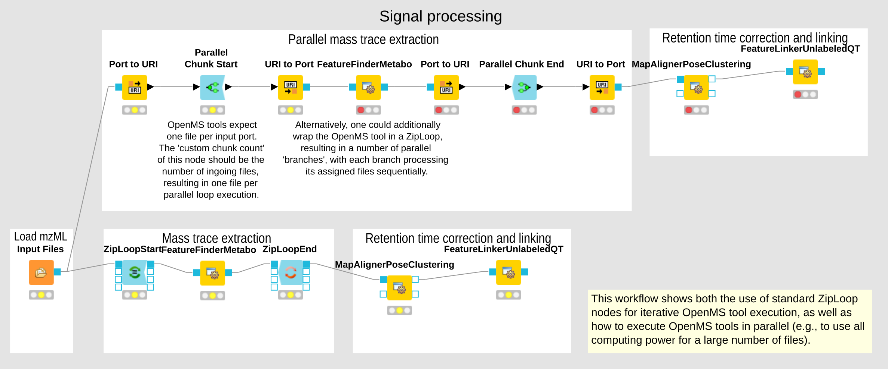

# openMS-workflows

Workflows for openMS using KNIME framework

### Introduction

Workflows for protein identification and quantification are implemented as openMS nodes in the KNIME framework. 
All recent wokflows are purely based on openSM. Older workflows include some additional steps that require external command line based tools outside of KNIME/openMS.
All workflows are intended for protein MS samples obtained in data-dependent acquisition (DDA) mode.

### Content

- `TMT_label_MSGFplus` - workflow for TMT10 labeled DDA MS samples, using MSGF+, Percolator, and IsobaricAnalyzer (KNIME v4.5.0, *maintained*)
- `labelfree_MSGFplus_Percolator_FFI` - workflow for labelfree quantification of DDA MS samples, using MSGF+, Percolator and FeatureFinderIdentification (KNIME v4.5.0, *maintained*)
- `labelfree_MSGFplus` - workflow for labelfree quantification of DDA MS samples, using MSGF+, DemixQ and Diffacto (KNIME v4.5.0, *not maintained*)
- `examples` - contains an example workflow for parallel processing (KNIME v3.1.0, *not maintained*)

### Related publications

- The KNIME workflow `labelfree_MSGFplus` was used in the publication [Jahn et al., Cell Reports, 2018](https://www.cell.com/cell-reports/fulltext/S2211-1247(18)31485-2)
- The KNIME workflow `labelfree_MSGFplus_Percolator_FFI` was used in the publication [Jahn et al., eLife, 2021](https://www.cell.com/cell-reports/fulltext/S2211-1247(18)31485-2)

### Installation

- Download and install KNIME/openMS according to http://www.openms.de/getting-started/creating-workflows/
- Download the recent MS-GF+ search engine JAVA executable (most likely already contained in openMS' MSGFPlus Adapter)
- Download scripts for DemixQ (https://github.com/userbz/DeMix-Q) and Diffacto (https://github.com/statisticalbiotechnology/diffacto) algorithms (optional data processing)

### Workflow details

Details are documented in the README.md for each workflow in the respective subfolders.
