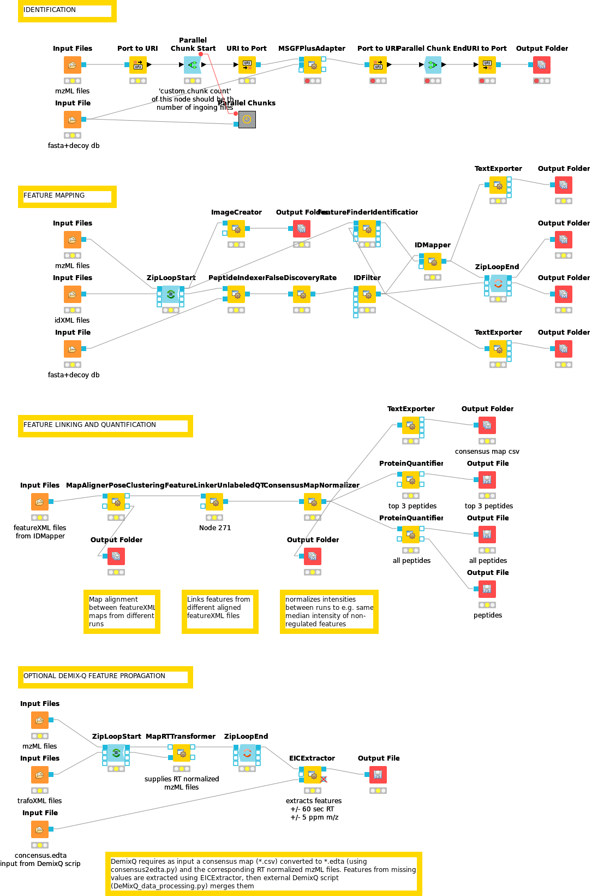

# openMS-workflows

workflows for openMS using KNIME framework

### Basic remarks

Workflows for protein identification and quantification are implemented as openMS nodes in the KNIME framework. 
Some steps however require external command line based tools outside of KNIME/openMS. 
Below is a step by step guide through each of the stages of the workflow.
The KNIME workflow *labelfree_MSGFplus* was used in our recent publication, *Jahn et al., 2018, Cell Reports*: https://www.cell.com/cell-reports/fulltext/S2211-1247(18)31485-2. The following description of the single modules
mainly refers to the workflow used in this publication.

### Installation

- Download and install KNIME/openMS according to http://www.openms.de/getting-started/creating-workflows/
- Download the recent MS-GF+ search engine JAVA executable (most likely already contained in openMS' MSGFPlus Adapter)
- Download scripts for DemixQ (https://github.com/userbz/DeMix-Q) and Diffacto (https://github.com/statisticalbiotechnology/diffacto) algorithms (optional data processing)

### Pre-processing

The original raw spectra files as obtained from the MS instruments are converted to the 
mzML standard using *Proteowizard’s MSConvert tool* (Adusumilli and Mallick, 2017). Peptide 
identification and label-free quantification are then performed independently and the information 
resulting from both is subsequently merged by means of a custom openMS pipeline that makes use 
of the *OpenMS tools* (Röst et al., 2016) and the *DeMixQ workflow* (Zhang et al., 2016) briefly 
explained as follows. 

### Peptide identification / Search engine

MS/MS spectra are subjected to sequence database searching using 
the OpenMS implementation of the *MS-GF+ search engine* (Kim and Pevzner, 2014) and a protein sequence database 
in fasta format. A typical fixed modification is carbamidomethylation on cysteines and 
oxidation as a potential mass shift on methionines. The precursor ion mass window tolerance was set to 10 ppm. 
The enzyme digestion pattern was set to Trypsin/P and fully tryptic digest. The MS-GF+ adapter was executed 
within a parallel execution node set using 'Parallel Chunk Start' and 'Parallel Chunk End'. The output 
from MS-GF+ are idXML identification files.

### Percolator to determine peptide FDR (optional)

An alternative to the standard FDR calculation described in the next module is to use *Percolator* 
([Granhol et al., 2014, J Prot Res](https://pubs.acs.org/doi/10.1021/pr400937n)) *in combination with MS-GF+*. 
In order to do so, the _add_features_ flag has to be set to TRUE in MS-GF+, and additional peptide 'features' 
are extracted and added to the idXML output using the *PSMFeatureExtractor* module. Then, *PercolatorAdapter* uses
these features to construct a machine learning model and calculate a peptide FDR score for each identification. 
The last step is to filter by a certain FDR threshold (usually 0.01) using *IDFilter* as in the next module.

### FDR filtering and feature mapping

The next series of nodes are executed in order to index and filter identified peptides according to 
the false discovery rate (FDR) and to map the identified peptides to chromatographic features in the 
mzML raw data. First, the error rate in identification was estimated using the OpenMS tool *PeptideIndexer*, 
that annotates identified peptides corresponding to target or decoy status. The *FalseDiscoveryRate* node 
is used to estimate the FDR for each identified peptide based on target and decoy frequencies, and the 
*IDFilter* note keeps only peptides with q-values lower than 0.01 (FDR 1%) in every individual run. 
Next, the *FeatureFinderIdentification* tool detects MS1 features based on retention time and mass to charge 
coordinates provided by the FDR-filtered identification result files. 
Features are annotated with a peptide identification by *IDMapper* and exported as featureXML files. 

### Feature linking and quantification

The following series of steps is performed to link (compare) features between different MS runs (or samples). 
The *MapAlignerPoseClustering* node is used to correct shifts and distortions 
between the retention time scales in the featureXML files used as input. *FeatureLinkerUnlabeledQT* 
creates a consensus feature map by finding the equivalent corresponding features across MS runs. 
*ConsensusMapNormalizer* performs an optional normalization according to e.g. mean or median of all 
feature intensities per MS run. This step can alleviate global distortions of feature intensity due to unequal loading 
or MS quantification.

### Demix-Q feature propagation (optional)

The missing values problem can be adressed using the *DeMix-Q* approach (Zhang et al, 2016). 
Missing values are a typical problem of shotgun MS analysis in data-dependent acquisition mode. 
Since the MS instrument automatically picks the most abundant features for MS2 fragmentation and 
identification, different sets of peptides are identified in each MS run. To alleviate that, Demix-Q 
performs an additional step of feature-based peptide propagation consisting of a more *sensitive recovery of 
extracted-ion chromatograms (XICs)* at the consensus locations (tolerance window 120 sec 
in RT, 10 ppm in m/z ratio) using the *EICExtractor* node. The EICExtractor requires as input a consensus map (*.csv) 
converted to .edta (using *consensus2edta.py*) and the corresponding RT normalized mzML files. Finally, 
the external DemixQ script (*DeMixQ_data_processing.py*) merges the single .csv files into a consensus .csv file 
including missing value estimation for runs where a feature could not be found yet an XIC signal was present. 
It optionally employs an MS run-wise K-nearest neighbours regression (KNN, K=5) based on other feature intensities 
having the most similar XIC profiles. To validate this complementary ion-based propagation, 
a target-decoy strategy was applied to the recovered XIC signals, setting a 5% feature-level 
FDR (Zhang et al., 2016).

### Diffacto peptide covariation filtering (optional)

The last step is an optional filtering of peptides by covariation score before aggregating peptide to protein quantity. 
This step is performed by the external python script *run_diffacto.py*. Quantification is additionally based on covariation weights. 
It takes as input:
- the peptide consensus feature file as *.csv
- the fasta database as *.csv
- a list of samples with names and replicates as *.csv

