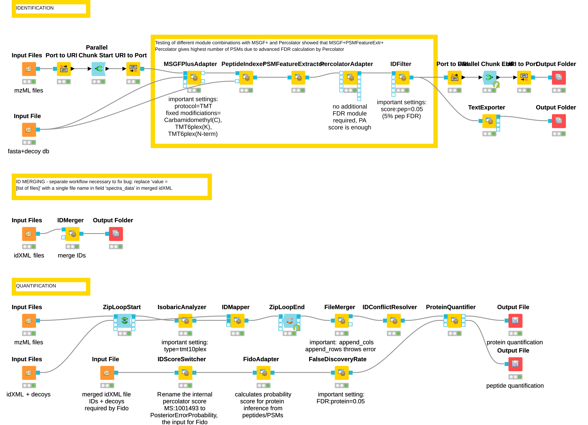

# TMT_label_MSGFplus

Workflow for TMT10 labeled DDA MS samples, using MSGF+, Percolator, and IsobaricAnalyzer

### Version

- KNIME: 4.5.0
- OpenMS: 2.7.0

### Pre-processing

Raw spectra files as obtained from the MS instruments must be converted to the mzML standard using **Proteowizard’s MSConvert tool** (Adusumilli and Mallick, 2017).

### Peptide identification / Search engine

MS/MS spectra are subjected to sequence database searching using the OpenMS implementation of the **MS-GF+ search engine** (Kim and Pevzner, 2014) and a protein sequence database in fasta format.

Important search parameters:

- Fixed modifications: Carbamidomethylation on cysteines (C), TMT6plex on Lysines (K), TMT6plex on N-term
- Variable modifications: Oxidation on methionines (M)

### Percolator to determine peptide FDR (optional)

An alternative to the standard FDR calculation described in the next module is to use **Percolator** 
([Granhol et al., 2014, J Prot Res](https://pubs.acs.org/doi/10.1021/pr400937n)) **in combination with MS-GF+**. 
In order to do so, the `add_features` flag has to be set to TRUE in MS-GF+, and additional peptide 'features' are extracted and added to the idXML output using the **PSMFeatureExtractor** module. Then, **PercolatorAdapter** uses these features to construct a machine learning model and calculate a peptide FDR score for each identification.
The last step is to filter by a certain FDR threshold (usually 0.01) using **IDFilter** as in the next module.

### Quantification

For quantification, the **IsobaricAnalyzer** node is used with the correct isotopic label setup, such as TMT10plex. A correction matrix does not need to be specified.
Quantifications from IsobaricAnalyzer are then mapped to identifications using **IDMapper**. Protein quantification can be performed using **ProteinQuantifier**, with additional imput from a protein inference pipeline.

### Protein inference

For protein inference, all idXML files from different runs are merged using **IDMerger** including the decoy identifications. This is important for Fido adapter which inferes protein presence from peptide and decoy scores. The next important tool when using Percolator is **IDScoreSwitcher**. The internal percolator score `MS:1001493` needs to be be renamed to `PosteriorErrorProbability` to serve as input for **FidoAdapter**. Protein results are then filtered by FDR on protein level, and then passed as protein IDs to ProteinQuantifier.

