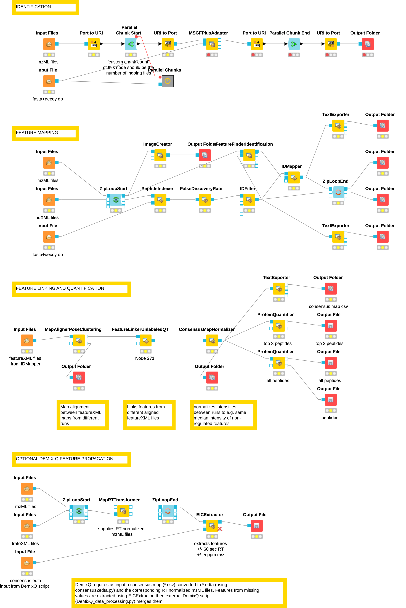

# labelfree_MSGFplus

Workflow for labelfree quantification of DDA MS samples, using MSGF+, DemixQ and Diffacto

### Version

- KNIME: 3.6.2
- OpenMS: 2.4.0

### Pre-processing

Raw spectra files as obtained from the MS instruments must be converted to the mzML standard using **Proteowizard’s MSConvert tool** (Adusumilli and Mallick, 2017).

### Peptide identification / Search engine

MS/MS spectra are subjected to sequence database searching using 
the OpenMS implementation of the **MS-GF+ search engine** (Kim and Pevzner, 2014) and a protein sequence database 
in fasta format. A typical fixed modification is carbamidomethylation on cysteines and 
oxidation as a potential mass shift on methionines. The precursor ion mass window tolerance was set to 10 ppm. 
The enzyme digestion pattern was set to Trypsin/P and fully tryptic digest. The MS-GF+ adapter was executed 
within a parallel execution node set using 'Parallel Chunk Start' and 'Parallel Chunk End'. The output 
from MS-GF+ are idXML identification files.

### FDR filtering and feature mapping

The next series of nodes are executed in order to index and filter identified peptides according to 
the false discovery rate (FDR) and to map the identified peptides to chromatographic features in the 
mzML raw data. First, the error rate in identification was estimated using the OpenMS tool **PeptideIndexer**, 
that annotates identified peptides corresponding to target or decoy status. The **FalseDiscoveryRate** node 
is used to estimate the FDR for each identified peptide based on target and decoy frequencies, and the 
**IDFilter** note keeps only peptides with q-values lower than 0.01 (FDR 1%) in every individual run.

### Feature linking and quantification

The following series of steps is performed to link (compare) features between different MS runs (or samples). 
The **MapAlignerPoseClustering** node is used to correct shifts and distortions 
between the retention time scales in the featureXML files used as input. **FeatureLinkerUnlabeledQT** 
creates a consensus feature map by finding the equivalent corresponding features across MS runs. 
**ConsensusMapNormalizer** performs an optional normalization according to e.g. mean or median of all 
feature intensities per MS run. This step can alleviate global distortions of feature intensity due to unequal loading 
or MS quantification.

### Demix-Q feature propagation (optional)

The missing values problem can be adressed using the **DeMix-Q** approach (Zhang et al, 2016). 
Missing values are a typical problem of shotgun MS analysis in data-dependent acquisition mode. 
Since the MS instrument automatically picks the most abundant features for MS2 fragmentation and 
identification, different sets of peptides are identified in each MS run. To alleviate that, Demix-Q 
performs an additional step of feature-based peptide propagation consisting of a more 
**sensitive recovery of extracted-ion chromatograms (XICs)** at the consensus locations (tolerance window 120 sec 
in RT, 10 ppm in m/z ratio) using the **EICExtractor** node. The EICExtractor requires as input a consensus map (.csv) 
converted to .edta (using **consensus2edta.py**) and the corresponding RT normalized mzML files. Finally, 
the external DemixQ script (**DeMixQ_data_processing.py**) merges the single .csv files into a consensus .csv file 
including missing value estimation for runs where a feature could not be found yet an XIC signal was present. 
It optionally employs an MS run-wise K-nearest neighbours regression (KNN, K=5) based on other feature intensities 
having the most similar XIC profiles. To validate this complementary ion-based propagation, 
a target-decoy strategy was applied to the recovered XIC signals, setting a 5% feature-level 
FDR (Zhang et al., 2016).

### Diffacto peptide covariation filtering (optional)

The last step is an optional filtering of peptides by covariation score before aggregating peptide to protein quantity. 
This step is performed by the external python script **run_diffacto.py**. Quantification is additionally based on covariation weights. 
It takes as input:
- the peptide consensus feature file as .csv
- the fasta database as .csv
- a list of samples with names and replicates as .csv
