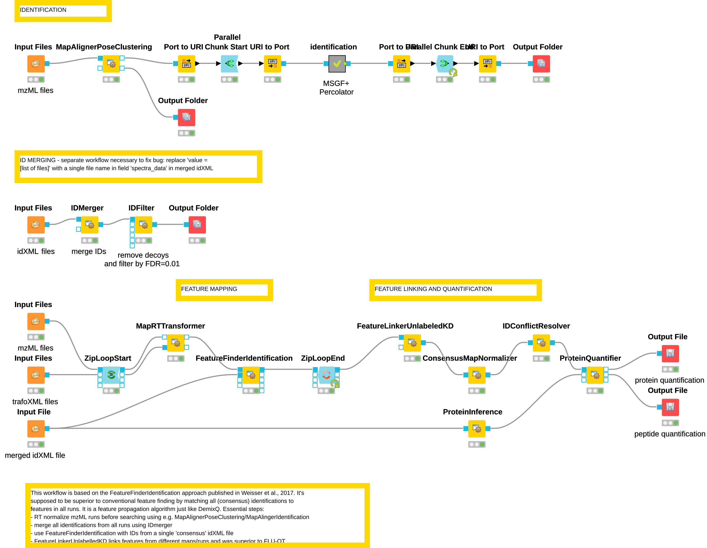

# labelfree_MSGFplus_Percolator_FFI

Workflow for labelfree quantification of DDA MS samples, using MSGF+, Percolator and FeatureFinderIdentification.
Based on the publication by [Weisser et al., 2017](https://pubs.acs.org/doi/abs/10.1021/acs.jproteome.7b00248).

----------

### Version

- KNIME: 4.5.0
- OpenMS: 2.7.0

### Pre-processing

Raw spectra files as obtained from the MS instruments must be converted to the mzML standard using **Proteowizard’s MSConvert tool** (Adusumilli and Mallick, 2017).

### Peptide identification / Search engine

MS/MS spectra are subjected to sequence database searching using the OpenMS implementation of the **MS-GF+ search engine** (Kim and Pevzner, 2014) and a protein sequence database in fasta format.

Search parameters:

- Fixed modifications: Carbamidomethylation on cysteines (C)
- Variable modifications: Oxidation on methionines (M)

### Percolator to determine peptide FDR

An alternative to the standard FDR calculation described in the next module is to use **Percolator** 
([Granhol et al., 2014, J Prot Res](https://pubs.acs.org/doi/10.1021/pr400937n)) **in combination with MS-GF+**. 
In order to do so, the _add_features_ flag has to be set to TRUE in MS-GF+, and additional peptide 'features' 
are extracted and added to the idXML output using the **PSMFeatureExtractor** module. Then, **PercolatorAdapter** uses
these features to construct a machine learning model and calculate a peptide FDR score for each identification. 
The last step is to filter by a certain FDR threshold (usually 0.01) using **IDFilter** as in the next module.

### Feature mapping

This is a crucial step of this workflow. It applies a sort of Feature propagation algorithm similar to the DemixQ workflow or the matching between runs from MaxQuant.
First, all IDs from all runs are merged using **IDMerger** and this consensus identification list is then passed to **FeatureFinderIdentification**. This node attempts to find MS1 features in the vicinity of the all annotated consensus IDs, thereby increasing the peptide/protein coverage greatly. A peptide identified in one run can then be matched to features in all other runs.

### Feature linking and quantification

The following series of steps is performed to link (compare) features between different MS runs (or samples). 
The **MapAlignerPoseClustering** node is used to correct shifts and distortions 
between the retention time scales in the featureXML files used as input. **FeatureLinkerUnlabeledKD** 
creates a consensus feature map by finding the equivalent corresponding features across MS runs. 
**ConsensusMapNormalizer** performs an optional normalization according to e.g. mean or median of all 
feature intensities per MS run. This step can alleviate global distortions of feature intensity due to unequal loading 
or MS quantification.

